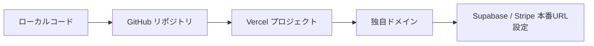

# Vercel 本番デプロイ手順

TGPLUS を GitHub → Vercel → 独自ドメインまで公開する手順です。

**前提:** Stripe Live キー・Supabase 本番プロジェクト・独自ドメイン（例: `tgplus.jp`）を用意してください。

---

## 全体の流れ



1. GitHub にプッシュ
2. Vercel でリポジトリをインポート
3. 環境変数を設定してデプロイ
4. 独自ドメインを接続
5. Supabase・Stripe の URL を本番ドメインに更新

---

## Step 1: GitHub へプッシュ

### 1-1. Git のインストール（未導入の場合）

- https://git-scm.com/download/win からインストール
- インストール後、PowerShell を**再起動**

### 1-2. GitHub でリポジトリ作成

1. https://github.com/new を開く
2. Repository name: `tgplus`（任意）
3. **Private** 推奨（Stripe / Supabase の設定情報を誤って含めないため）
4. README / .gitignore は**追加しない**（ローカルに既にあるため）
5. **Create repository**

### 1-3. ローカルから初回プッシュ

PowerShell でプロジェクトフォルダへ移動:

```powershell
cd C:\Users\tgplu\tgplus
```

初回のみ:

```powershell
git init
git add .
git status
```

**確認:** `.env.local` がステージに含まれていないこと（`.gitignore` で除外済み）。

```powershell
git commit -m "Initial commit: TGPLUS production ready"
git branch -M main
git remote add origin https://github.com/（あなたのユーザー名）/tgplus.git
git push -u origin main
```

> GitHub 認証が求められたら、Personal Access Token または GitHub CLI でログインしてください。

### 1-4. 以降の更新

```powershell
git add .
git commit -m "変更内容の説明"
git push
```

Vercel は `main` ブランチへの push を検知して**自動再デプロイ**します。

---

## Step 2: Vercel プロジェクト作成

### 2-1. アカウント連携

1. https://vercel.com にログイン（GitHub アカウント連携推奨）
2. **Add New… → Project**

### 2-2. リポジトリをインポート

1. **Import Git Repository** で `tgplus` を選択
2. **Import**

### 2-3. ビルド設定（そのままで OK）

| 項目 | 値 |
|------|-----|
| Framework Preset | Next.js（自動検出） |
| Root Directory | `./` |
| Build Command | `npm run build` |
| Output Directory | （デフォルト・変更不要） |
| Install Command | `npm install` |

`vercel.json` で東京リージョン（`hnd1`）が指定済みです。

### 2-4. 環境変数を先に設定

**Deploy の前に** Environment Variables を追加してください（後からでも可）。

**Environment:** すべて **Production** にチェック。Preview / Development は必要に応じてテスト用を別途設定。

| 変数名 | 値の例 | 備考 |
|--------|--------|------|
| `NEXT_PUBLIC_SUPABASE_URL` | `https://xxxx.supabase.co` | Supabase Dashboard → Settings → API |
| `NEXT_PUBLIC_SUPABASE_ANON_KEY` | `eyJ...` | 同上（anon public） |
| `SUPABASE_SERVICE_ROLE_KEY` | `eyJ...` | **サーバー専用・秘密** |
| `NEXT_PUBLIC_APP_URL` | `https://tgplus.jp` | **本番ドメイン（確定後に設定）** |
| `STRIPE_SECRET_KEY` | `sk_live_...` | Live モードのみ |
| `NEXT_PUBLIC_STRIPE_PUBLISHABLE_KEY` | `pk_live_...` | Live モードのみ |
| `STRIPE_WEBHOOK_SECRET_LIVE` | `whsec_...` | 本番 Webhook 作成後 |
| `STRIPE_SUPPORTER_PRICE_ID_LIVE` | `price_...` | 月額¥1,000 の Price ID |
| `STRIPE_PLATFORM_FEE_RATE` | `0.1` | 手数料 10% |

**設定しないもの（本番）:**

- `STRIPE_ALLOW_TEST_IN_PRODUCTION`
- `ENABLE_TEST_POINT_PURCHASE`
- テスト用 `sk_test_` / `pk_test_`（本番では混在禁止）

### 2-5. デプロイ

1. **Deploy** をクリック
2. ビルド完了まで待つ（数分）
3. 仮 URL（例: `https://tgplus-xxx.vercel.app`）で表示確認

---

## Step 3: 独自ドメイン設定

### 3-1. Vercel にドメイン追加

1. Vercel プロジェクト → **Settings → Domains**
2. ドメインを入力（例: `tgplus.jp` と `www.tgplus.jp`）
3. **Add**

### 3-2. DNS 設定（ドメイン管理画面）

Vercel が表示する指示に従います。一般的な例:

**ルートドメイン（`tgplus.jp`）**

| Type | Name | Value |
|------|------|-------|
| A | `@` | `76.76.21.21` |

**www サブドメイン**

| Type | Name | Value |
|------|------|-------|
| CNAME | `www` | `cname.vercel-dns.com` |

> レジストラ（お名前.com、ムームードメイン等）によって画面名は異なります。

### 3-3. SSL・反映待ち

- Vercel が自動で HTTPS 証明書を発行（数分〜最大 48 時間）
- **Domains** 画面で **Valid** になれば完了

### 3-4. 本番 URL の確定

ドメインが有効になったら:

1. Vercel → **Settings → Environment Variables**
2. `NEXT_PUBLIC_APP_URL` を `https://tgplus.jp`（実際のドメイン）に更新
3. **Redeploy**（Deployments → 最新 → ⋮ → Redeploy）

**推奨:** `www` → ルートへリダイレクト、またはその逆を Domains 設定で統一。

---

## Step 4: Supabase 本番 URL 設定

Supabase Dashboard → **Authentication → URL Configuration**

| 項目 | 値 |
|------|-----|
| Site URL | `https://tgplus.jp` |
| Redirect URLs | `https://tgplus.jp/**` |

**Additional Redirect URLs（必要に応じて）:**

```
https://tgplus.jp/points/purchase/success
https://tgplus.jp/supporter/success
https://tgplus.jp/login
```

メール確認・OAuth を使う場合は同様に本番ドメインを追加してください。

---

## Step 5: Stripe 本番 Webhook

1. Stripe Dashboard → **本番モード**に切替
2. **開発者 → Webhook → エンドポイントを追加**
3. URL:

```
https://tgplus.jp/api/stripe/webhook
```

4. イベント（最低限）:

- `checkout.session.completed`
- `payment_intent.succeeded`
- `payment_intent.payment_failed`
- `invoice.paid`
- `invoice.payment_failed`
- `customer.subscription.created`
- `customer.subscription.updated`
- `customer.subscription.deleted`
- `charge.refunded`

5. 署名シークレット `whsec_...` を Vercel の `STRIPE_WEBHOOK_SECRET_LIVE` に設定
6. **Redeploy**

詳細は `docs/STRIPE_DASHBOARD_TASKS.md` を参照。

---

## Step 6: 本番動作確認チェックリスト

デプロイ後、本番ドメインで確認:

- [ ] トップページ表示（`https://tgplus.jp`）
- [ ] ログイン / 登録
- [ ] ポイント購入（少額テスト）
- [ ] サポーター加入（¥1,000/月）
- [ ] ギフト送信
- [ ] 管理画面（`/admin/dashboard`）
- [ ] Stripe Webhook が 200 で応答（Stripe Dashboard → Webhook → 最近の配信）

ローカル確認用:

```powershell
node scripts/verify-production-readiness.mjs
```

（本番用 Live キーを `.env.local` に設定した状態で実行）

---

## よくあるトラブル

### ビルド失敗

- Vercel の **Deployment → Building** ログを確認
- ローカルで `npm run build` が通るか確認

### ログイン後にリダイレクトループ

- Supabase の Site URL / Redirect URLs が本番ドメインと一致しているか確認

### Stripe Checkout が開かない

- `NEXT_PUBLIC_APP_URL` が本番 HTTPS URL か確認
- Live キーと Price ID が本番モードか確認

### Webhook が失敗（400 / 500）

- `STRIPE_WEBHOOK_SECRET_LIVE` が正しいか
- `SUPABASE_SERVICE_ROLE_KEY` が Vercel に設定されているか
- Supabase で `production-v1-schema.sql` / `production-payment-v2-schema.sql` 実行済みか

### 環境変数を変更したのに反映されない

- Vercel は環境変数変更後 **Redeploy が必要** な場合があります

---

## セキュリティ注意

- `.env.local` は**絶対に GitHub に push しない**
- `SUPABASE_SERVICE_ROLE_KEY` / `STRIPE_SECRET_KEY` は Vercel の **Production** のみに設定
- リポジトリは **Private** 推奨

---

## 関連ドキュメント

- `docs/STRIPE_DASHBOARD_TASKS.md` — Stripe ダッシュボード作業
- `docs/PRODUCTION_SETUP.md` — Supabase SQL・決済モデル
- `.env.example` — 環境変数テンプレート
